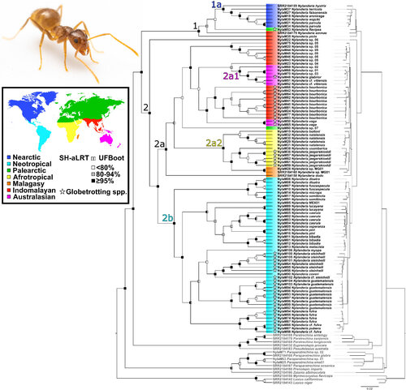
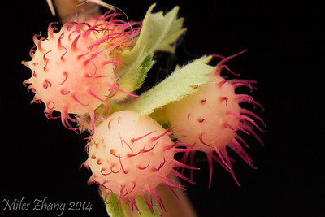
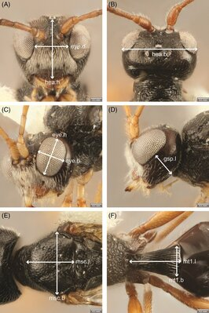

# Y. Miles Zhang, PhD
## Postdoc, USDA, Systematic Entomology Lab
 Email: yuanmeng.zhang AT gmail.com 
[Twitter](https://twitter.com/ymilesz) 
[ResearchGate](https://www.researchgate.net/profile/Yuanmeng_Zhang) 
[GoogleScholar](https://scholar.google.com/citations?user=kUZTyoQAAAAJ&hl=en) 

I am an evolutionary biologist specializing in the diversity and evolution of parasitic wasps. These organisms, though often tiny, contribute an estimated 20% of terrestrial animal species and play diverse and important roles in many ecosystems, including natural control of insect pests. However, the evolutionary forces that have driven the explosive diversification of parasitic wasps remain poorly-understood. My long-term aim is to establish and lead a research group that explores the causation of the enormous abundance and species richness of specialized herbivores and their associated parasitoid communities. Only with such understanding can we predict, for example, the consequences of climate change on the abundance and distribution of these systems and its effect on the ecosystem.  

## EDUCATION
2016 – 2018	Ph.D. Biology, University of Central Florida  
2013 – 2015	Ph.D. Entomology University of Manitoba (transferred with advisor)  
Advisor: Dr. [Barbara Sharanowski](https://sciences.ucf.edu/biology/sharanowski-lab/)  
2009 – 2012	M.Sc. Biology, Laurentian University  
Advisor: Dr. [Joseph Shorthouse](https://laurentian.ca/faculty/jshorthous)  
2004 – 2009	B.Sc. Zoology, University of Guelph

## PROFESSIONAL EXPERIENCES
2020 - Present ORISE Postdoctoral Research Scholar, USDA SEL  
Advisor: Dr. [Michael Gates](https://www.ars.usda.gov/people-locations/person/?person-id=36205)  
2018 – 2020	Postdoctoral Research Associate, University of Florida  
Advisor: Dr. [Andrea Lucky](http://www.andrealucky.com/)  
2018	Adjunct Lecturer, University of Central Florida  
2016 – 2018	Instructor of Record, University of Central Florida  
2014 – 2015	Graduate Teaching Assistant, University of Manitoba  
2010 – 2012	Graduate Teaching Assistant, Laurentian University  

## RESEARCH
**Hymenoptera Phylogenomics using Ultraconserved Elements (UCEs)**  
My current postdoc work focuses on using UCEs to generate genomic-level data to reconstruct the phylogeny of Ants, Rose Gall Wasps (Cynipidae: _Diplolepis_), Oak Gall Parasitoids (Eurytomidae: _Sycophila_), and designing probe sets for nematodes (Order Rhabditida). Ultraconserved elements have been shown to be very effective at resolving phylogenetic relationships at both deep and shallow evolutionary scale, and can be used on older museum specimens that have degraded DNA. I have also led a review paper on arthropod UCEs phylogenomics, which explains the technique and offers best-practice tips for downstream analyses. 
  
Formicidae: _Nylanderia fulva_

**Taxonomy and Systematics of Gall Wasps and Associated Natural Enemies**  
I am also interested in taxonomy of gall wasp and their associated natural enemies, in particular Eurytomidae. For my masters degree I revised the Canadian species of eurytomids associated with rose gall wasps (Cynipidae: _Diplolepis_). I used _COI_ to delimit species and provided an updated key along with the description of a new species. I have also used _COI_ to rebuild the phylogeny of _Diplolepis_ and their inquiline _Periclistus_, which shows the both genera are in need of revision and gall morphology alone is not enough to identify these species. A few other related collaboration projects I've worked on includes the insects associated with the crypt gall wasp _Bassettia pallida_, including describing the crypt keeper wasp _Euderus set_. Currently I am revising oak gall wasp _Belonocnema_, and describing the gall community associated with _Smilax_ in southern Florida. 
  
Cynipidae: _Diplolepis polita_

**The Evolution of _Peristenus_ (Hymenoptera: Braconidae): Taxonomy, Phylogenetics and Ecological Speciation**  
The focus of my PhD research was to investigate speciation patterns of  euphorine braconid wasps at the genus, species, and population level. _Peristenus_ are parasitoids agricultural pests such as Lygus bugs. I built a multilocus phylogeny of the tribe Euphorini and revised generic concepts (Zhang et al 2018a); revised the North American _Peristenus pallipes_ complex using a combination of molecular, morphometrics, and ecological data; and used ddRADSeq to determine that temporal separation is likely a key driver behind the _Lygus-Peristenus_ system.  
  
Braconidae: _Peristenus mellipes_

## PUBLICATIONS 

**REFEREED JOURNALS (16)**

**2020** 
**Zhang, Y.M.**, Buffington, M.L., Looney, C., László, Z., Shorthouse, J.D., Ide, T., Lucky, A. (2020). UCE data reveal multiple origins of rose gallers in North America: Global phylogeny of _Diplolepis_ Geoffrey (Hymenoptera: Cynipidae). In Press at Molecular Phylogenetics & Evolution. <https://doi.org/10.1016/j.ympev.2020.106949>
Lucky, A., Atchison, R.A., Ohyama, L., **Zhang, Y.M.**, Williams, J.L., Pinkney, J.L., Clancy, K.L., Nielsen, A.N., Lippi, C.A. (2020). Myrmecology, Gender, and Geography: changing demographics of a research community over thirty years. Myrmecological News, 30: 187-199. <https://doi.org/10.25849/myrmecol.news_030:187>
Wienersmith, K.L., Forbes, A.A., Ward, A.K.G., Brandão-Dias, P.F.P., **Zhang, Y.M.**, Egan, S.P. (2020) Invertebrate Community Associated with the Asexual Generation of _Bassettia pallida_ Ashmead (Hymenoptera: Cynipidae). Early View at Annals of the Entomological Society of America. <https://doi.org/10.1093/aesa/saaa009>
Williams, J.L., **Zhang, Y.M.**, Lloyd, M.W., LaPolla, J.S., Schultz, T.R., Lucky, A. (2020) Global domination by crazy ants: Phylogenomics reveals biogeographic history and invasive species relationships in the genus _Nylanderia_ (Hymenoptera, Formicidae). Early View at Systematic Entomology. <https://doi.org/10.1111/syen.12423>

**2019** 
**Zhang, Y.M.**, Vitone, T., Storer, C.G., Payton, A.C., Dunn, R.R., Hulcr, J., McDaniel, S.F., Lucky, A. (2019) From pavement to population genomics: characterizing a long-established non-native ant in North America through citizen science and ddRADseq. Frontiers in Ecology & Evolution. 7: 453. <https://doi.org/10.3389/fevo.2019.00453>
**Zhang, Y.M.**, László, Z., Looney, C., Dénes, A.-L., Hanner, R.H., Shorthouse, J.D. (2019) DNA barcodes reveal inconsistent species boundaries in _Diplolepis_ rose gall wasps and their _Periclistus_ inquilines (Hymenoptera: Cynipidae) based on DNA barcodes. The Canadian Entomologist. 151: 717–727. <https://doi.org/10.4039/tce.2019.59>
**Zhang, Y.M.**, Williams, J.L., Lucky, A. (2019) Understanding UCEs: A comprehensive primer on using Ultraconserved Elements for arthropod phylogenomics. Insect Systematics and Diversity, 3: 3. <https://doi.org/10.1093/isd/ixz016>
Hogan, J.M., Bass, A.I.H., **Zhang, Y.M.**, Sharanowski, B.J. (2019). Integrating multiple sources of biodiversity information suggests range expansion of a rare species of Hymenoptera (Vanhorniidae). Biodiversity Data Journal, 7: e37569. <https://doi.org/10.3897/BDJ.7.e37569>

**2018** 
**Zhang, Y.M.**, Bass, A.I.H., Fernández, D.C., Sharanowski, B.J. (2018). Habitat or Temporal Isolation: Unravelling herbivore-parasitoid speciation patterns using double digest RADseq. Ecology and Evolution, 8: 9803–9816. <https://doi.org/10.1002/ece3.4457>
**Zhang, Y.M.**, Stigenberg, J., Meyer, J., Sharanowski, B.J. (2018). Multilocus phylogeny of the parasitic wasps in the tribe Euphorini (Braconidae: Euphorinae) with revised generic classifications. PeerJ, 6: e4783. <https://doi.org/10.7717/peerj.4783>

**2017** 
**Zhang, Y.M.**, Gates, M.W., Shorthouse, J.D. (2017). Revision of Canadian Eurytomidae (Hymenoptera, Chalcidoidea) associated with galls induced by cynipid wasps of the genus _Diplolepis_ Geoffroy (Hymenoptera, Cynipidae) and description of a new species. Journal of Hymenoptera Research, 61: 1–29. <https://doi.org/10.3897/jhr.61.13466>
**Zhang, Y.M.**, Ridenbaugh, R.D., Sharanowski, B.J. (2017). Integrative taxonomy improves understanding of native beneficial fauna: Revision of the Nearctic _Peristenus pallipes_ complex (Hymenoptera: Braconidae) and implications for release of exotic biocontrol agents. Systematic Entomology, 42: 596-608. <https://doi.org/10.1111/syen.12233> **Top 20 Most Downloaded Paper for Systematic Entomology in 2017/2018**
Egan, S.P., Weinersmith, K.L., Liu, S., Ridenbaugh, R.D., **Zhang, Y.M.**, Forbes, A.A. (2017). Description of a new species of _Euderus_ Haliday from the southeastern United States (Hymenoptera, Chalcidoidea, Eulophidae): the crypt-keeper wasp. ZooKeys, 645: 37–49. <https://doi.org/10.3897/zookeys.645.11117> **Featured in Science News, National Geographic, Popular Science, Eureka Alert, Daily Mail**

**2014** 
Quicke, D.L.J., Shaw, M.R., van Achterberg, C., Bland, K.P., Butcher, B.A., Lyszkowski, R., **Zhang, Y.M.** (2014). A new Australian genus and six new species of Rogadinae (Hymenoptera: Braconidae), one reared as gregarious endoparasitoid of an unidentified limacodid (Lepidoptera). Zootaxa, 3881: 237–257. <https://doi.org/10.11646/zootaxa.3881.3.3>
**Zhang, Y.M.**, Sharanowski, B.J. (2014). New species of _Eudiospilus_ (Braconidae, Brachistinae) from Madagascar with a review of the genus and key to species. Zootaxa, 3838: 120-126. <https://doi.org/10.11646/zootaxa.3838.1.7>
**Zhang, Y.M.**, Gates, M.W., Shorthouse, J.D. (2014). Testing species limits of Eurytomidae (Hymenoptera) associated with galls induced by _Diplolepis_ (Hymenoptera: Cynipidae) in Canada using an integrative approach. The Canadian Entomologist, 146: 321–334. <https://doi.org/10.4039/tce.2013.70>

**REFEREED BOOK CHAPTERS (2)**

Stigenberg, J., **Zhang, Y.M.** (In Press). New findings of the subfamily Euphorinae (Hymenoptera, Braconidae) from Papua New Guinea, with descriptions, illustrations, and molecular data. Invited book chapter for Insects of Mount Wilhelm, Papua New Guinea Vol II.
Sharanowski, B.J., **Zhang,Y.M.**, Wanigasekara, R.W.M.U.M. (2014). Annotated Checklist of Braconidae (Hymenoptera) in the Canadian Prairies Ecozone. In: Arthropods of Canadian Grasslands. Volume 4: Biodiversity and Systematics, Part 2. Edited by: D. J. Giberson and H. A. Cárcamo. Biological Survey of Canada. Chapter 10, pp 399-425. <https://doi.org/10.3752/9780968932179.ch10>

**NON-REFEREED PUBLICATION (1)**

**Zhang,Y.M.** (2019). Continued pursuit of Alfred Kinsey’s first love: Status of the North American gall wasps and their parasitoids 100 years later. Bulletin of the Entomological Society of Canada, 51: 95–98.

**SOFTWARE (1)**

Sharanowski, B.J., Dal Molin, A., Bass, A., Cattani, D., Gavloski, J., Gulden, R., Irwin, L. Joyce, J., Leeson, J., McKay, K., Meers, S., Morales-Naranjo, S., Olfert, O., Otani, J., Peixoto, L., Philip, H., Rios, A., Svendsen, E., Turkington, K., Turley, N., Weiss, R., **Zhang, Y.M.** (2018). Mobile-IPM: A Pest and Crop management tool for Canadian field crops. <www.mobile-ipm.com>
