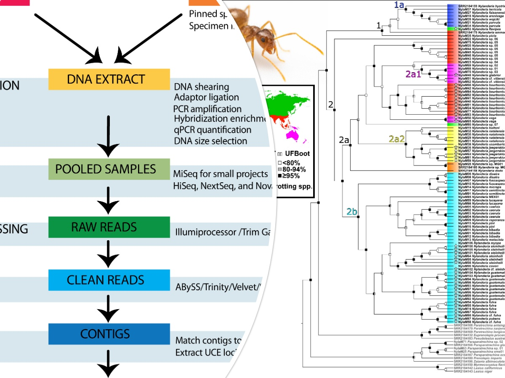
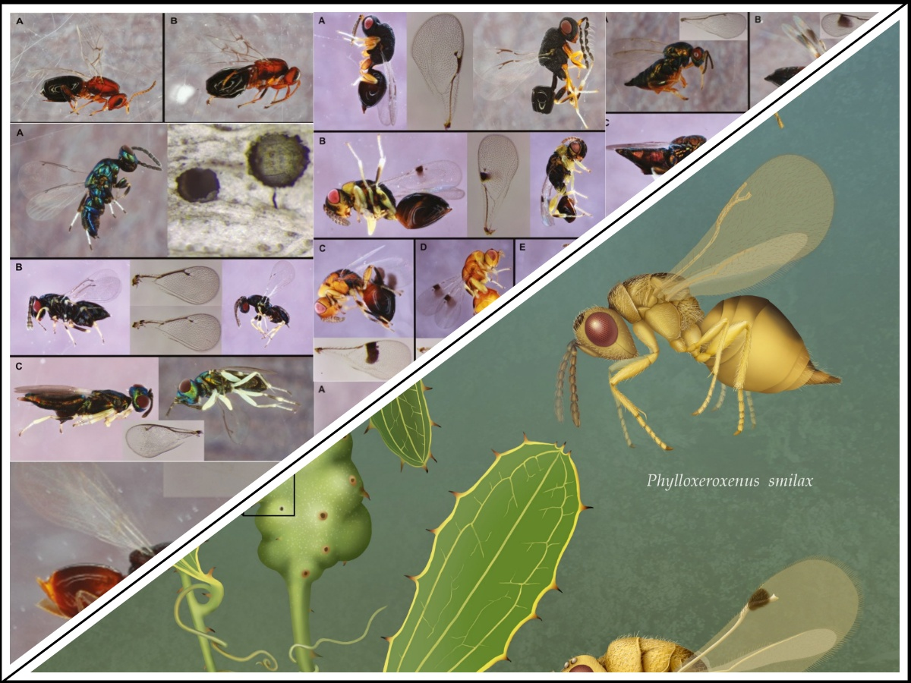
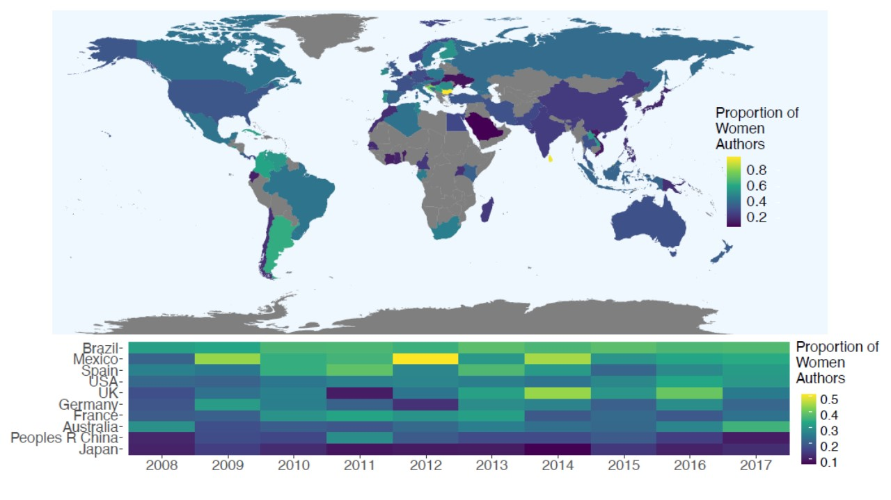

# Y. Miles Zhang, PhD
## Postdoc, USDA, Systematic Entomology Lab
 Email: yuanmeng.zhang AT gmail.com 
[Twitter](https://twitter.com/ymilesz) 
[ResearchGate](https://www.researchgate.net/profile/Yuanmeng_Zhang) 
[GoogleScholar](https://scholar.google.com/citations?user=kUZTyoQAAAAJ&hl=en) 

I am an evolutionary biologist specializing in the diversity and evolution of parasitic wasps. These organisms, though often tiny, contribute an estimated 20% of terrestrial animal species and play diverse and important roles in many ecosystems, including natural control of insect pests. However, the evolutionary forces that have driven the explosive diversification of parasitic wasps remain poorly-understood. My long-term aim is to establish and lead a research group that explores the causation of the enormous abundance and species richness of specialized herbivores and their associated parasitoid communities. Only with such understanding can we predict, for example, the consequences of climate change on the abundance and distribution of these systems and its effect on the ecosystem.  
See my interview on [Entomology Today](https://entomologytoday.org/2020/12/21/entomologist-academic-probation-smithsonian-yuanmeng-miles-zhang-standout-early-career-professional/) 
## EDUCATION
2016 – 2018	Ph.D. Biology, University of Central Florida  
2013 – 2015	Ph.D. Entomology University of Manitoba (transferred with advisor)  
Advisor: Dr. [Barbara Sharanowski](https://sciences.ucf.edu/biology/sharanowski-lab/)  
2009 – 2012	M.Sc. Biology, Laurentian University  
Advisor: Dr. [Joseph Shorthouse](https://laurentian.ca/faculty/jshorthous)  
2004 – 2009	B.Sc. Zoology, University of Guelph

## PROFESSIONAL EXPERIENCES
2020 - Present ORISE Postdoctoral Research Scholar, USDA SEL  
Advisor: Dr. [Michael Gates](https://www.ars.usda.gov/people-locations/person/?person-id=36205)  
2018 – 2020	Postdoctoral Research Associate, University of Florida  
Advisor: Dr. [Andrea Lucky](http://www.andrealucky.com/)  
2018	Adjunct Lecturer, University of Central Florida  
2016 – 2018	Instructor of Record, University of Central Florida  
2014 – 2015	Graduate Teaching Assistant, University of Manitoba  
2010 – 2012	Graduate Teaching Assistant, Laurentian University  

## RESEARCH

### Hymenoptera Phylogenomics using Ultraconserved Elements (UCEs)
My postdoc work focuses on using UCEs to generate genomic-level data to reconstruct the phylogeny of Hymenoptera:  
  
1. **Zhang, Y.M.**, Williams, J.L., Lucky, A. (2019) Understanding UCEs: A comprehensive primer on using Ultraconserved Elements for arthropod phylogenomics. Insect Systematics and Diversity, 3: 3. [PDF](Pubs/Zhang et al 2019 - Understanding UCEs.pdf)  
2. Williams, J.L., **Zhang, Y.M.**, Lloyd, M.W., LaPolla, J.S., Schultz, T.R., Lucky, A. (2020) Global domination by crazy ants: Phylogenomics reveals biogeographic history and invasive species relationships in the genus _Nylanderia_ (Hymenoptera, Formicidae). Systematic Entomology, 45: 730–744. [PDF](Pubs/Williams et al 2020 - Nylanderia UCE.pdf)  
3. **Zhang, Y.M.**, Buffington, M.L., Looney, C., László, Z., Shorthouse, J.D., Ide, T., Lucky, A. (2020). UCE data reveal multiple origins of rose gallers in North America: Global phylogeny of _Diplolepis_ Geoffrey (Hymenoptera: Cynipidae). Molecular Phylogenetics & Evolution, 153: 106949. [PDF](Pubs/Zhang et al 2020 - Diplolepis UCE.pdf)   

### Taxonomy and Systematics of Parasitoid Wasps
I am also interested in taxonomy of parasitoid wasps, in particular gall wasp (Cynipidae) and seed chalcids (Eurytomidae):  
 
1. **Zhang, Y.M.**, Gates, M.W., Shorthouse, J.D. (2014). Testing species limits of Eurytomidae (Hymenoptera) associated with galls induced by _Diplolepis_ (Hymenoptera: Cynipidae) in Canada using an integrative approach. The Canadian Entomologist, 146: 321–334. [PDF](Pubs/Zhang et al 2014 - Eurytomid Diplolepis Barcode.pdf)  
2. Egan, S.P., Weinersmith, K.L., Liu, S., Ridenbaugh, R.D., **Zhang, Y.M.**, Forbes, A.A. (2017). Description of a new species of _Euderus_ Haliday from the southeastern United States (Hymenoptera, Chalcidoidea, Eulophidae): the crypt-keeper wasp. ZooKeys, 645: 37–49. [PDF](Pubs/Egan et al 2017 - Euderus set.pdf) **Featured in Science News, National Geographic, Popular Science, Eureka Alert, Daily Mail**  
3. **Zhang, Y.M.**, Gates, M.W., Shorthouse, J.D. (2017). Revision of Canadian Eurytomidae (Hymenoptera, Chalcidoidea) associated with galls induced by cynipid wasps of the genus _Diplolepis_ Geoffroy (Hymenoptera, Cynipidae) and description of a new species. Journal of Hymenoptera Research, 61: 1–29. [PDF](Pubs/Zhang et al 2017 - Eurytomid Diplolepis Revision.pdf)  
4. **Zhang, Y.M.**, László, Z., Looney, C., Dénes, A.-L., Hanner, R.H., Shorthouse, J.D. (2019) DNA barcodes reveal inconsistent species boundaries in _Diplolepis_ rose gall wasps and their _Periclistus_ inquilines (Hymenoptera: Cynipidae) based on DNA barcodes. The Canadian Entomologist, 151: 717–727. [PDF](Pubs/Zhang et al 2019 - Diplolepis barcoding.pdf)  
5. Wienersmith, K.L., Forbes, A.A., Ward, A.K.G., Brandão-Dias, P.F.P., **Zhang, Y.M.**, Egan, S.P. (2020) Invertebrate Community Associated with the Asexual Generation of _Bassettia pallida_ Ashmead (Hymenoptera: Cynipidae). Annals of the Entomological Society of America, 113: 373–388. [PDF](Pubs/Wienersmith et al 2020 - Bassettia pallida community.pdf)  
6. Gates, M.W., **Zhang, Y.M.**, Buffington, M.L. (2020) The great greenbriers gall mystery resolved? New species of _Aprostocetus_ Westwood (Hymenoptera, Eulophidae) gall inducer and two new parasitoids (Hymenoptera, Eurytomidae) associated with _Smilax_ L. in southern Florida, USA. Journal of Hymenoptera Research, 80: 71-98. [PDF](Pubs/Gates et al 2020 - Smilax gall.pdf)  
7. **Zhang, Y.M.**, Egan, S.P., Driscoe, A.L., Ott, J.R. (2021) One Hundred and Sixty Years of Taxonomic Confusion Resolved: _Belonocnema_ Mayr (Hymenoptera: Cynipidae, Cynipini) Gall Wasps Associated with Live Oaks in the USA. Zoological Journal of the Linnean Society. 193: 1234-1255. [PDF](Pubs/Zhang et al 2021 - Belonocnema.pdf)  
8. **Zhang, Y.M.**, Gates, M.W., Silvestre, R., Scarpa, M. (2021) Description of Kavayva gen. n. (Chalcidoidea, Eurytomidae) and two new species associated with Guarea (Meliaceae), and a review of eurytomids associated with seeds. Journal of Hymenoptera Research. 86: 101–121. [PDF](Pubs/Zhang et al 2021 - Kavayva.pdf) Corrigendum [PDF](Pubs/Zhang et al 2021 - Corrigendum Kavayva.pdf)  

### Taxonomy, Phylogenetics and Ecological Speciation of Braconid Wasps
The focus of my PhD research was to investigate speciation patterns of  euphorine braconid wasps at the genus, species, and population level:  
  
1. Sharanowski, B.J., **Zhang,Y.M.**, Wanigasekara, R.W.M.U.M. (2014). Annotated Checklist of Braconidae (Hymenoptera) in the Canadian Prairies Ecozone. In: Arthropods of Canadian Grasslands. Volume 4: Biodiversity and Systematics, Part 2. Edited by: D. J. Giberson and H. A. Cárcamo. Biological Survey of Canada. Chapter 10, pp 399-425. [PDF](Pubs/Sharanowski et al 2014 - Braconid checklist.pdf)  
2. **Zhang, Y.M.**, Sharanowski, B.J. (2014). New species of _Eudiospilus_ (Braconidae, Brachistinae) from Madagascar with a review of the genus and key to species. Zootaxa, 3838: 120-126. [PDF](Pubs/Zhang & Sharanowski 2014 - Eudiospilus.pdf)  
3. Quicke, D.L.J., Shaw, M.R., van Achterberg, C., Bland, K.P., Butcher, B.A., Lyszkowski, R., **Zhang, Y.M.** (2014). A new Australian genus and six new species of Rogadinae (Hymenoptera: Braconidae), one reared as gregarious endoparasitoid of an unidentified limacodid (Lepidoptera). Zootaxa, 3881: 237–257. [PDF](Pubs/Quicke et al 2014 - Rogadine.pdf)  
4. **Zhang, Y.M.**, Ridenbaugh, R.D., Sharanowski, B.J. (2017). Integrative taxonomy improves understanding of native beneficial fauna: Revision of the Nearctic _Peristenus pallipes_ complex (Hymenoptera: Braconidae) and implications for release of exotic biocontrol agents. Systematic Entomology, 42: 596-608. [PDF](Pubs/Zhang et al 2017 - Peristenus pallipes.pdf) **Top 20 Most Downloaded Paper for Systematic Entomology in 2017/2018**  
5. **Zhang, Y.M.**, Stigenberg, J., Meyer, J., Sharanowski, B.J. (2018). Multilocus phylogeny of the parasitic wasps in the tribe Euphorini (Braconidae: Euphorinae) with revised generic classifications. PeerJ, 6: e4783. [PDF](Pubs/Zhang et al 2018 - Euphorini.pdf)  
6. **Zhang, Y.M.**, Bass, A.I.H., Fernández, D.C., Sharanowski, B.J. (2018). Habitat or Temporal Isolation: Unravelling herbivore-parasitoid speciation patterns using double digest RADseq. Ecology and Evolution, 8: 9803–9816. [PDF](Pubs/Zhang et al 2018 - HAD.pdf)  
7. Stigenberg, J., **Zhang, Y.M.** (2020). New findings of the subfamily Euphorinae (Hymenoptera: Braconidae) from Papua New Guinea, with descriptions, illustrations, and molecular data. In: Insects of Mount Wilhelm, Papua New Guinea Volume II. Edited by: T. Robillard, F. Legendre, C. Villemant, and M. Leponce. French Museum of Natural History, pp 145–190. [PDF](Pubs/Stigenberg & Zhang 2020 - PNG Euphorinae.pdf)  

### Other Publications
I've also dabbled in various topics:
  
1. Hogan, J.M., Bass, A.I.H., **Zhang, Y.M.**, Sharanowski, B.J. (2019). Integrating multiple sources of biodiversity information suggests range expansion of a rare species of Hymenoptera (Vanhorniidae). Biodiversity Data Journal, 7: e37569. [PDF](Pubs/Hogan et al 2019 - Vanhornia.pdf)  
2. **Zhang, Y.M.**, Vitone, T., Storer, C.G., Payton, A.C., Dunn, R.R., Hulcr, J., McDaniel, S.F., Lucky, A. (2019) From pavement to population genomics: characterizing a long-established non-native ant in North America through citizen science and ddRADseq. Frontiers in Ecology & Evolution. 7: 453. [PDF](Pubs/Zhang et al 2019 - Tetramorium.pdf)  
3. Lucky, A., Atchison, R.A., Ohyama, L., **Zhang, Y.M.**, Williams, J.L., Pinkney, J.L., Clancy, K.L., Nielsen, A.N., Lippi, C.A. (2020). Myrmecology, Gender, and Geography: changing demographics of a research community over thirty years. Myrmecological News, 30: 187-199. [PDF](Pubs/Lucky et al 2020 - WIM.pdf) **Best Paper Award 2020**  
4. Huber, J.T., Bennett, A.M.R., Gibson, G.A.P., **Zhang, Y.M.**, Darling, D.C. (2021). Checklist of Chalcidoidea and Mymarommatoidea (Hymenoptera) of Canada, Alaska and Greenland. Journal of Hymenoptera Research 82: 69-138. [PDF](Pubs/Huber et al 2021 - Checklist of Chalcidoidea.pdf)

