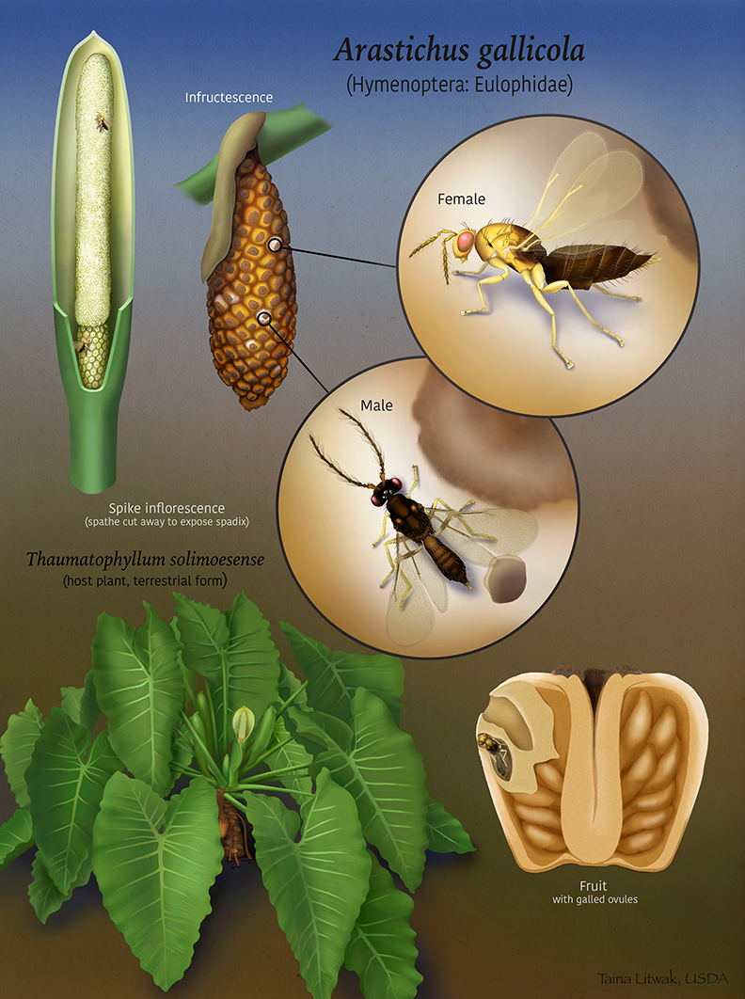
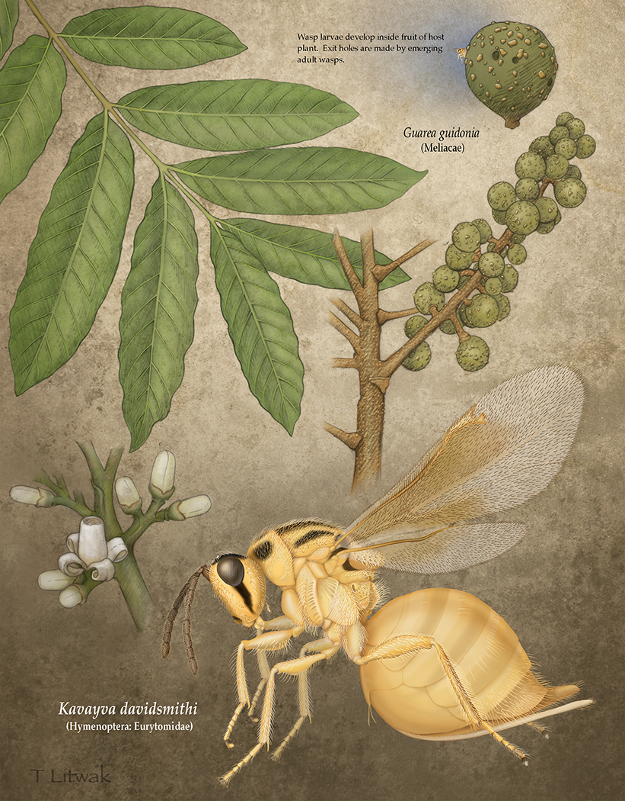
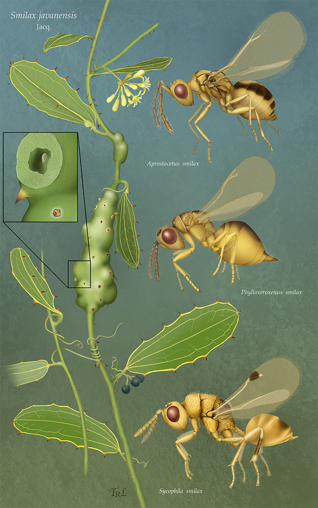

# Y. Miles Zhang, PhD
## ORISE Postdoctoral Fellow, USDA Pacific Basin Agricultural Research Center
 Email: yuanmeng.zhang AT gmail.com 
[Bluesky](https://bsky.app/profile/ymilesz.bsky.social) 
[ResearchGate](https://www.researchgate.net/profile/Yuanmeng_Zhang) 
[GoogleScholar](https://scholar.google.com/citations?user=kUZTyoQAAAAJ&hl=en) 

I am an evolutionary biologist specializing in the diversity and evolution of parasitic wasps. These organisms, though often tiny, contribute an estimated 20% of terrestrial animal species and play diverse and important roles in many ecosystems, including natural control of insect pests. However, the evolutionary forces that have driven the explosive diversification of parasitic wasps remain poorly-understood. My long-term aim is to establish and lead a research group that explores the causation of the enormous abundance and species richness of specialized herbivores and their associated parasitoid communities. Only with such understanding can we predict, for example, the consequences of climate change on the abundance and distribution of these systems and its effect on the ecosystem.  

My interview on [Entomology Today](https://entomologytoday.org/2020/12/21/entomologist-academic-probation-smithsonian-yuanmeng-miles-zhang-standout-early-career-professional/) 
TED-Ed Lesson on [The bizarre world of parasitic wasps](https://youtu.be/xqaX2yi0VF8) 

## EDUCATION & PROFESSIONAL EXPERIENCES
2025 - Present ORISE Postdoctoral Fellow, USDA PBARC  
Advisor: Dr. [Sheina Sim](https://www.ars.usda.gov/pacific-west-area/hilo-hi/daniel-k-inouye-us-pacific-basin-agricultural-research-center/tropical-pest-genetics-and-molecular-biology-research-unit/people/sheina-sim/)   
2022 - 2024 Marie Skłodowska-Curie Actions Postdoctoral Fellow, University of Edinburgh  
Advisor: Prof. [Graham Stone](https://www.ed.ac.uk/profile/graham-stone)  
2020 - 2022 ORISE Postdoctoral Fellow, USDA SEL  
Advisor: Dr. [Michael Gates](https://www.ars.usda.gov/people-locations/person/?person-id=36205)  
2018 – 2020	Postdoctoral Research Associate, University of Florida  
Advisor: Dr. [Andrea Lucky](http://www.andrealucky.com/)  
2016 – 2018	Ph.D. Biology, University of Central Florida  
2013 – 2015	Ph.D. Entomology University of Manitoba (transferred with advisor)  
Advisor: Dr. [Barbara Sharanowski](https://sciences.ucf.edu/biology/sharanowski-lab/)  
2009 – 2012	M.Sc. Biology, Laurentian University  
Advisor: Dr. [Joseph Shorthouse](https://laurentian.ca/faculty/JShorthouse)  
2004 – 2009	B.Sc. Zoology, University of Guelph

## RESEARCH
I mostly work with systematics, phylogenomics, and evolution of Hymenoptera, in particular gall wasps and their associated parasitoids. I also dabble in similar topics using a variety of organisms such as ants, beetles, and nematodes.

**2025**
1. **Zhang YM**, Bossert S, Spasojevic T. (2025). Evolving Perspectives in Hymenoptera Systematics: Bridging Fossils and Genomes Across Time. **Systematic Entomology**, 50(1): 1-31. [PDF](Pubs/Zhang et al 2025 - Hymenoptera Review.pdf)  
2. Borowiec ML, **Zhang YM**, Neves K, Ramalho MO, Fisher BL, Lucky A, Moreau CS. (2025). Evaluating UCE data adequacy and integrating uncertainty in a comprehensive phylogeny of the ants. **Systematic Biology**, syaf001. [Early View](https://doi.org/10.1093/sysbio/syaf001)  
3. Castillejos-Lemus DE, Nieves-Aldrey JL, **Zhang YM**, Nicholls JA, Medianero E, Rougon-Cardoso A, Stone GN, Oyama K. (2025). Phylogenomic Insights and Geographic Distribution of the New World Genus _Amphibolips_ Reinhard (Hymenoptera: Cynipidae, Cynipini) Using Ultraconserved Elements (UCEs). **Systematic Entomology**, 50(2): 349–368. [PDF](Pubs/Castillejos-Lemus et al 2025 - Amphibolips.pdf)  
5. Sinclair FH, Tang C-T, Bailey RA, Csóka GL, Melika G, Nicholls JA, Nieves-Aldrey J-L, Reiss A, **Zhang YM**, Phillimore A, Schönrogge K, Stone GN. (2025). Quantifying phylogenetic and nonphylogenetic patterns in the richness, frequency, and identity of links in a herbivore-parasitoid interaction network. **The American Naturalist**, [Early View](https://doi.org/10.1086/735854)  
6. Gates MW, Delvare, G, **Zhang YM** (2025). Eurytomidae. In: **Chalcidoidea of the World**. Edited by: Heraty JM, Woolley JB, CABI Press, Oxford, UK. Chapter 30, pp 397–414. [PDF](Pubs/Gates et al 2025 - Eurytomidae.pdf)  
7. **Zhang YM**, Delvare G, Blaimer BB, Cruaud A, Rasplus J-Y, Brady SG, Gates MW. (2025). Phasing in and out of phytophagy: phylogeny and evolution of the family Eurytomidae (Hymenoptera: Chalcidoidea) based on Ultraconserved Elements. **Systematic Entomology**, Syen.12682, 1-14 [PDF](Pubs/Zhang et al 2025 - Eurytomidae UCE.pdf)  

**2024**
1. Lackner T, **Zhang YM**, Kindler C, Motyka M, Balke M. (2024). Saprininae: phylogeny, biogeography and a new classification of the subfamily (Coleoptera: Histeridae). **Systematic Entomology**, 49(1): 48–71. [PDF](Pubs/Lackner et al 2024 - Saprininae.pdf)  
2. Ward AKG, **Zhang YM**, Brown GE, Hippee AC, Prior KM, Rollins S, Sierra N, Sheikh SI, Tribull CM, Forbes AA. (2024). Speciation in kleptoparasites of oak gall wasps often correlates with shifts into new tree habitats, tree organs, and gall morphospace. **Evolution**, 78: 174–187. [PDF](Pubs/Ward et al 2024 - Inquilines.pdf)  
3. Fang Z, Tang C-T, Sinclair F, Csóka G, Hearn J, McCormack K, Melika G, Mikolajczak KM, Nicholls JA, Nieves-Aldrey J-L, Notton DG, Radosevic S, Bailey RI, Reiss A, **Zhang YM**, Zhu Y, Fang S, Schönrogge K, Stone GN. (2024). Network structure and taxonomic composition of tritrophic communities of Fagaceae, cynipid gallwasps and parasitoids in Sichuan, China. **Insect Conservation and Diversity**, 17(6): 1046–1071. [PDF](Pubs/Fang et al 2024 - Sichuan.pdf)  
4. Gibson GAP, Uriel Y, Sherwood J, Abram P, Gariepy TD, **Zhang YM**, Baur H, Gates MW, Franklin MT. (2024). The species of _Pteromalus_ Swederus in America north of Mexico with a 4:4 mandibular formula, and description of a potential biocontrol agent of the introduced pest _Anthonomus rubi_ (Herbst) (Coleoptera: Curculionidae). **Zootaxa**, 5501(2): 201-236. [PDF](Pubs/Gibson et al 2024 - Pteromalus.pdf)  
5. Nastasi LF, Smith CN, Davis, CK, Ward, AKG, Brown G, **Zhang YM**, Rollins S, Friesen C, Tribull CM, Forbes AA, Deans AR. (2024). One must imagine Sisyphus happy: Integrative taxonomic characterization of 22 new _Ceroptres_ species (Hymenoptera: Cynipidae: Ceroptresini). **Zootaxa**, 5508(1): 1–63. [PDF](Pubs/Nastasi et al 2024 - Ceroptres.pdf)  
6. Qing X, **Zhang YM** (equal contribution as 1st author), Sun S, Ahmed M, Lo W-S, Bert W, Holovachov O, Li H. (2024). Phylogenomic Insights into the Evolution and Origin of Nematoda. **Systematic Biology**, syae073. [PDF](Pubs/Qing et al 2024 - Nematoda Phylogeny.pdf)  

**2023**
1. Pujade-Villar J, **Zhang YM**, Buffington ML, Brothers DJ, Lobato-Vila I, Cuesta-Porta V. (2023). On the specific epithet “_vaccinii_” of Ashmead, 1887 and Burks, 1979 (Hymenoptera, Cynipidae). **Journal of Hymenoptera Research**, 96: 955–965. [PDF](Pubs/Pujade-Villar et al 2023 - vaccinii.pdf)  
2. Orr MC, Hughes AC, Torres Carvajal O, Ferrari RR, Luo A, Rajaei H, Ron SR, Warrit N, Zamani A, **Zhang YM**, Zhu C-D. (2023). Inclusive and productive ways forward needed for species-naming conventions. **Nature Ecology & Evolution**, 7: 1168–1169. [PDF](Pubs/Orr et al 2023 - Species Naming.pdf)  

**2022**
1. Brandão-Dias PFP, **Zhang YM**, Pirro S, Vinson CC, Weinersmith KL, Ward AKG, Forbes AA, Egan SP (2022). Describing biodiversity in the genomics era: A new species of Nearctic Cynipidae gall wasp and its genome sequence. **Systematic Entomology**, 47(1): 94–112. [PDF](Pubs/Brandao-Dias et al 2022 - Neuroterus valhalla.pdf)  
2. Williams JL, **Zhang YM**, LaPolla JS, Schultz TR, Lucky A. (2022). Molecular Delimitation of Morphologically Cryptic Species in Globetrotting _Nylanderia_ (Hymenoptera: Formicidae) Species Complexes. **Insect Systematics and Diversity**, 6(1): 10. [PDF](Pubs/Williams et al 2022 - Nylanderia species complexes.pdf)  
3. Fernández DC, VanLaerhoven SL, Rodríguez-Leyva E, **Zhang YM**, Labbé, R. (2022). Population structure and genetic diversity of the pepper weevil (Coleoptera: Curculionidae) using the COI barcoding region. **Journal of Insect Science**, 22(1): 25. [PDF](Pubs/Fernandez et al 2022 - Pepper Weevil.pdf)
4. Campos-Moreno DF, Gates MW, **Zhang YM**, Pérez-Lachaud G, Dyer LA, Whitfield JB, Pozo C (2022). _Aximopsis gabrielae_ sp. nov.: A new gregarious parasitoid (Hymenoptera: Eurytomidae) of the skipper _Quadrus cerialis_ Stoll (Lepidoptera: Hesperiidae) feeding on _Piper amalago_ Kunth. in southern Mexico. **Journal of Natural History**, 56(1–4): 173–189. [PDF](Pubs/Campos-Moreno et al 2022 - Aximopsis gabrielae.pdf)  
5. Sheikh SI, Ward AKG, **Zhang YM**, Davis CK, Zhang L, Egan SP, Forbes AA (2022). _Ormyrus labotus_ Walker (Hymenoptera: Ormyridae): another generalist that should not be a generalist is not a generalist. **Insect Systematics and Diversity**, 6(1): 8. [PDF](Pubs/Sheikh et al 2022 - Ormyrus.pdf)  
6. **Zhang YM**, Sheikh SI, Ward AKG, Forbes AA, Prior KM, Stone GM, Gates MW, Egan SP, Zhang L, Davis C, Weinersmith KL, Melika G, Lucky A. (2022). Delimiting the cryptic diversity and host preferences of _Sycophila_ parasitoid wasps associated with oak galls using phylogenomic data. **Molecular Ecology**, 31(16): 4417–4433. [PDF](Pubs/Zhang et al 2022 - Sycophila.pdf)  
7. Ward AKG, Bagley RK, Egan SP, Hood GR, Ott JR, Prior KM, Sheikh SI, Weinersmith KL, Zhang L, **Zhang YM**, Forbes AA. (2022). Speciation in Nearctic oak gall wasps is frequently correlated with changes in host plant, host organ, or both. **Evolution**, 76(8): 1849-1867. [PDF](Pubs/Ward et al 2022 - Cynipini.pdf)  
8. **Zhang YM**, Sasan K, O’Kennon RJ, Kranz, AJ. (2022). Discovery through iNaturalist: new species and new records of oak gall wasps (Hymenoptera: Cynipidae: Cynipini) from Texas, USA. **Zootaxa**, 5168(1): 63–74. [PDF](Pubs/Zhang et al 2022 - Druon laceyi.pdf)  
9. Qing X, Peng H, Ma J, **Zhang YM**, Li H, Peng D, Wang X, Long T. (2022). Phylogeography of Chinese cereal cyst nematodes sheds lights on their origin and dispersal. **Evolutionary Applications**, 15(8): 1236–1248. [PDF](Pubs/Qing et al 2022 - Phylogeography of Chinese cereal cyst nematodes.pdf)  
10. **Zhang YM**, Gates MW, Hanson PE, Jansen-González, S. (2022). Description of a Neotropical gall inducer on Araceae: _Arastichus_, gen. n. (Hymenoptera: Eulophidae) and two new species. **Journal of Hymenoptera Research**, 92: 145–172. [PDF](Pubs/Zhang et al 2022 - Arastichus.pdf)  
11. Friesen C, **Zhang YM**. (2022). Rose gall wasps (Cynipidae: _Diplolepis_) of Manitoba, including a new provincial record. **The Proceedings of the Entomological Society of Manitoba**, 7: 52–60. [PDF](Pubs/Friesen & Zhang 2022 - Dgracilis.pdf)  
12. Ward AKG, Busbee, RW, Chen RA, Davis CD, Driscoe AL, Egan SP, Goldberg BAR, Hood GR, Jones D, Kranz AJ, Meadley-Dunphy SA, Milks AK, Ott JR, Prior KM, Sheikh SI, Shzu S, Weinersmith KL, Zhang L, **Zhang YM**, Forbes AA. (2022). The arthropod associates of 155 North American cynipid oak galls. **Zoological Studies**, 61: 57. [PDF](https://zoolstud.sinica.edu.tw/Journals/61/61-57.pdf)  
  
Illustration by Taina Litwak 

**2021**
1. **Zhang YM**, Egan SP, Driscoe AL, Ott JR (2021). One Hundred and Sixty Years of Taxonomic Confusion Resolved: _Belonocnema_ Mayr (Hymenoptera: Cynipidae, Cynipini) Gall Wasps Associated with Live Oaks in the USA. **Zoological Journal of the Linnean Society**, 193(4): 1234-1255. [PDF](Pubs/Zhang et al 2021 - Belonocnema.pdf)  
2. Huber JT, Bennett AMR, Gibson GAP, **Zhang YM**, Darling DC (2021). Checklist of Chalcidoidea and Mymarommatoidea (Hymenoptera) of Canada, Alaska and Greenland. **Journal of Hymenoptera Research**, 82: 69-138. [PDF](Pubs/Huber et al 2021 - Checklist of Chalcidoidea.pdf)  
3. **Zhang YM**, Gates MW, Silvestre R, Scarpa M (2021). Description of _Kavayva_ gen. n. (Chalcidoidea, Eurytomidae) and two new species associated with _Guarea_ (Meliaceae), and a review of eurytomids associated with seeds. **Journal of Hymenoptera Research**, 86: 101–121. [PDF](Pubs/Zhang et al 2021 - Kavayva.pdf)  
   
Illustration by Taina Litwak 

**2020**
1. Williams JL, **Zhang YM**, Lloyd MW, LaPolla JS, Schultz TR, Lucky A (2020). Global domination by crazy ants: Phylogenomics reveals biogeographic history and invasive species relationships in the genus _Nylanderia_ (Hymenoptera, Formicidae). **Systematic Entomology**, 45(4): 730–744. [PDF](Pubs/Williams et al 2020 - Nylanderia UCE.pdf)  
2. **Zhang YM**, Buffington ML, Looney C, László Z, Shorthouse JD, Ide T, Lucky A (2020). UCE data reveal multiple origins of rose gallers in North America: Global phylogeny of _Diplolepis_ Geoffrey (Hymenoptera: Cynipidae). **Molecular Phylogenetics & Evolution**, 153: 106949. [PDF](Pubs/Zhang et al 2020 - Diplolepis UCE.pdf)   
3. Lucky A, Atchison RA, Ohyama L, **Zhang YM**, Williams JL, Pinkney IV JL, Clancy KL, Nielsen AN, Lippi CA (2020). Myrmecology, Gender, and Geography: changing demographics of a research community over thirty years. **Myrmecological News**, 30: 187-199. [PDF](Pubs/Lucky et al 2020 - WIM.pdf) **Best Paper Award 2020**  
4. Stigenberg J, **Zhang YM** (2020). New findings of the subfamily Euphorinae (Hymenoptera: Braconidae) from Papua New Guinea, with descriptions, illustrations, and molecular data. In: **Insects of Mount Wilhelm, Papua New Guinea Volume II**. Edited by: Robillard T, Legendre F, Villemant C, Leponce M. French Museum of Natural History, pp 145–190. [PDF](Pubs/Stigenberg & Zhang 2020 - PNG Euphorinae.pdf)  
5. Weinersmith KL, Forbes AA, Ward AKG, Brandão-Dias PFP, **Zhang YM**, Egan SP (2020). Invertebrate Community Associated with the Asexual Generation of _Bassettia pallida_ Ashmead (Hymenoptera: Cynipidae). **Annals of the Entomological Society of America**, 113(5): 373–388. [PDF](Pubs/Wienersmith et al 2020 - Bassettia pallida community.pdf)  
6. Gates MW, **Zhang YM**, Buffington, M.L. (2020). The great greenbriers gall mystery resolved? New species of _Aprostocetus_ Westwood (Hymenoptera, Eulophidae) gall inducer and two new parasitoids (Hymenoptera, Eurytomidae) associated with _Smilax_ L. in southern Florida, USA. **Journal of Hymenoptera Research**, 80: 71-98. [PDF](Pubs/Gates et al 2020 - Smilax gall.pdf)  
  
Illustration by Taina Litwak 

**2019**
1. **Zhang YM**, Williams JL, Lucky A (2019). Understanding UCEs: A comprehensive primer on using Ultraconserved Elements for arthropod phylogenomics. **Insect Systematics and Diversity**, 3(5): 3. [PDF](Pubs/Zhang et al 2019 - Understanding UCEs.pdf)  
2. **Zhang YM**, Vitone T, Storer CG, Payton AC, Dunn RR, Hulcr J, McDaniel SF, Lucky A (2019). From pavement to population genomics: characterizing a long-established non-native ant in North America through citizen science and ddRADseq. **Frontiers in Ecology & Evolution**, 7: 453. [PDF](Pubs/Zhang et al 2019 - Tetramorium.pdf)  
3. Hogan JM, Bass AIH, **Zhang YM**, Sharanowski BJ (2019). Integrating multiple sources of biodiversity information suggests range expansion of a rare species of Hymenoptera (Vanhorniidae). **Biodiversity Data Journal**, 7: e37569. [PDF](Pubs/Hogan et al 2019 - Vanhornia.pdf)  
4. **Zhang YM**, László Z, Looney C, Dénes A-L, Hanner RH, Shorthouse JD (2019). DNA barcodes reveal inconsistent species boundaries in _Diplolepis_ rose gall wasps and their _Periclistus_ inquilines (Hymenoptera: Cynipidae) based on DNA barcodes. **The Canadian Entomologist**, 151(6): 717–727. [PDF](Pubs/Zhang et al 2019 - Diplolepis barcoding.pdf)  

**2018**
1. **Zhang YM**, Stigenberg J, Meyer J, Sharanowski BJ (2018). Multilocus phylogeny of the parasitic wasps in the tribe Euphorini (Braconidae: Euphorinae) with revised generic classifications. **PeerJ**, 6: e4783. [PDF](Pubs/Zhang et al 2018 - Euphorini.pdf)  
2. **Zhang YM**, Bass AIH, Fernández DC, Sharanowski BJ (2018). Habitat or Temporal Isolation: Unravelling herbivore-parasitoid speciation patterns using double digest RADseq. **Ecology and Evolution**, 8(19): 9803–9816. [PDF](Pubs/Zhang et al 2018 - HAD.pdf)  

**2017**
1. **Zhang YM**, Ridenbaugh RD, Sharanowski BJ (2017). Integrative taxonomy improves understanding of native beneficial fauna: Revision of the Nearctic _Peristenus pallipes_ complex (Hymenoptera: Braconidae) and implications for release of exotic biocontrol agents. **Systematic Entomology**, 42(3): 596-608. [PDF](Pubs/Zhang et al 2017 - Peristenus pallipes.pdf) **Top 20 Most Downloaded Paper for Systematic Entomology in 2017/2018**  
2. Egan SP, Weinersmith KL, Liu S, Ridenbaugh RD, **Zhang YM**, Forbes AA (2017). Description of a new species of _Euderus_ Haliday from the southeastern United States (Hymenoptera, Chalcidoidea, Eulophidae): the crypt-keeper wasp. **ZooKeys**, 645: 37–49. [PDF](Pubs/Egan et al 2017 - Euderus set.pdf) **Featured in Science News, National Geographic, Popular Science, Eureka Alert, Daily Mail**  
3. **Zhang YM**, Gates MW, Shorthouse JD (2017). Revision of Canadian Eurytomidae (Hymenoptera, Chalcidoidea) associated with galls induced by cynipid wasps of the genus _Diplolepis_ Geoffroy (Hymenoptera, Cynipidae) and description of a new species. **Journal of Hymenoptera Research**, 61: 1–29. [PDF](Pubs/Zhang et al 2017 - Eurytomid Diplolepis Revision.pdf)  

**2014**
1. Sharanowski BJ, **Zhang YM**, Wanigasekara RWMUM (2014). Annotated Checklist of Braconidae (Hymenoptera) in the Canadian Prairies Ecozone. In: **Arthropods of Canadian Grasslands. Volume 4: Biodiversity and Systematics, Part 2.** Edited by: Giberson DJ, Cárcamo, HA. Biological Survey of Canada. Chapter 10, pp 399-425. [PDF](Pubs/Sharanowski et al 2014 - Braconid checklist.pdf)  
2. **Zhang YM**, Sharanowski BJ (2014). New species of _Eudiospilus_ (Braconidae, Brachistinae) from Madagascar with a review of the genus and key to species. **Zootaxa**, 3838(1): 120-126. [PDF](Pubs/Zhang & Sharanowski 2014 - Eudiospilus.pdf)  
3. Quicke DLJ, Shaw MR, van Achterberg C, Bland KP, Butcher BA, Lyszkowski R, **Zhang YM** (2014). A new Australian genus and six new species of Rogadinae (Hymenoptera: Braconidae), one reared as gregarious endoparasitoid of an unidentified limacodid (Lepidoptera). **Zootaxa**, 3881(3): 237–257. [PDF](Pubs/Quicke et al 2014 - Rogadine.pdf)  
4. **Zhang YM**, Gates MW, Shorthouse JD (2014). Testing species limits of Eurytomidae (Hymenoptera) associated with galls induced by _Diplolepis_ (Hymenoptera: Cynipidae) in Canada using an integrative approach. **The Canadian Entomologist**, 146(3): 321–334. [PDF](Pubs/Zhang et al 2014 - Eurytomid Diplolepis Barcode.pdf)  

